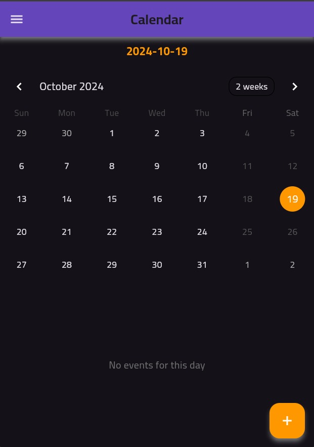
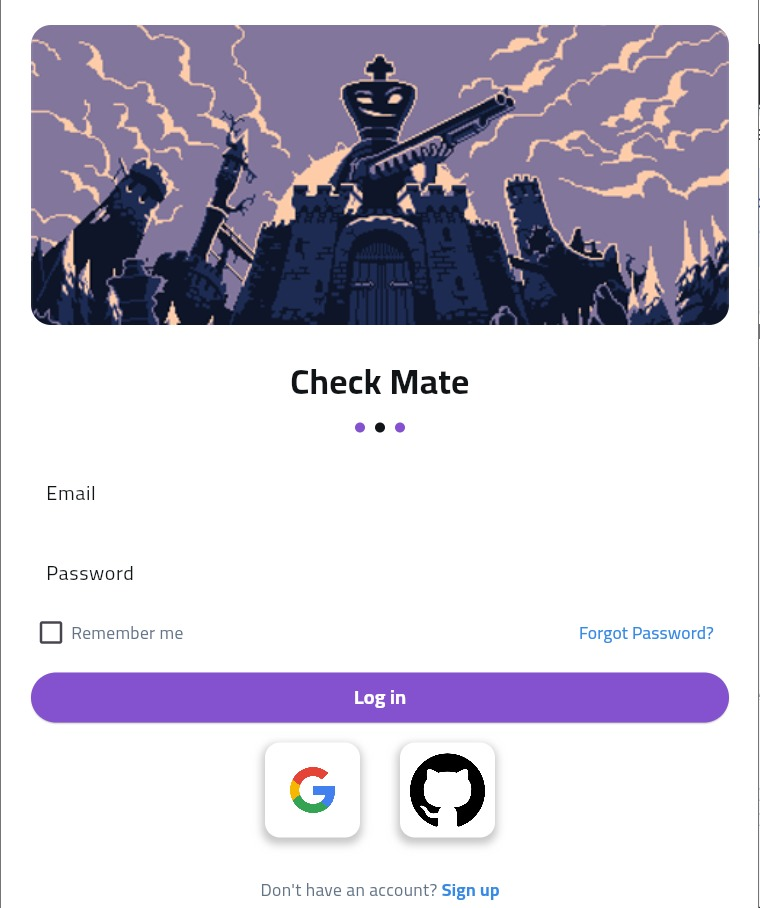
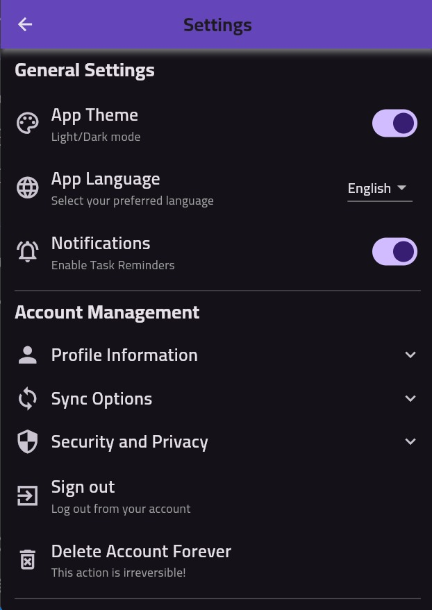
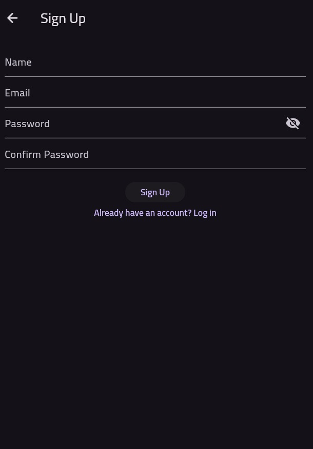

# CheckMate - A Flutter To-Do Application

 <!-- Add your logo image here -->

## Overview

CheckMate is a powerful and intuitive to-do application built using Flutter. It helps users efficiently manage tasks, events, meetings, and daily routines. The app provides feedback on your progress towards achieving your goals, allowing you to define the importance of each task (low, medium, hard) and set deadlines. Your progress is calculated based on these parameters, and you earn points or strikes, which are visualized in a graph to represent your progress over the year.

### Features

- **Task Management**: Add, edit, and delete tasks, events, and meetings.
- **Calendar Integration**: View and manage tasks through an intuitive calendar interface.
- **Daily Routines**: Keep track of your daily habits and routines.
- **Goal Tracking**: Define and track personal goals with weighted importance.
- **Progress Dashboard**: Monitor your progress with a comprehensive dashboard.
- **Points System**: Earn points for completing tasks and achieving goals.
- **Progress Visualization**: Visualize your achievements with interactive charts.
- **Secure Account System**: Register, login, and manage your account securely with Firebase.
- **Multiple Authentication Providers**:
  - **Google Sign-In**
  - **GitHub Sign-In**
- **Cloud Storage**: Store your tasks, routines, and goals online using Firestore.
- **Profile Insights**: View detailed statistics and insights on your profile page.
- **Customizable Settings**:
  - **App Theme**: Switch between light and dark modes.
  - **Account Management**: Edit your account details, reset your password, or delete your account.

## Screenshots

<div style="display: flex; gap: 10px;">
  
  
</div>

<!--<div style="display: flex; gap: 10px; margin-top: 10px;">
  
  
</div>-->

## Getting Started

### Prerequisites

- [Flutter SDK](https://flutter.dev/docs/get-started/install) installed.
- [Firebase Project](https://console.firebase.google.com/) configured with the app.
- IDE (e.g., VSCode or Android Studio).

### Installation

1. Clone the repository:
   ```bash
   git clone https://github.com/Amrr-Tarel/CheckMate.git
   ```
   
2. Navigate to the project directory:
   ```bash
   cd checkmate
   ```
   
3. Install dependencies:
   ```bash
   flutter pub get
   ```
   
4. Configure Firebase:
   - Follow the instructions [here](https://firebase.google.com/docs/flutter/setup?platform=android).

### Running the App

1. Ensure an emulator or device is connected.
2. Run the app:
   ```bash
   flutter run
   ```

## Dependencies

**Key dependencies** include:

- **Firebase**: For authentication and Firestore database.
- **Provider**: For state management.
- **Table Calendar**: For calendar support.

Refer to `pubspec.yaml` for the full list of dependencies.

## License

This project is licensed under the MIT License. See the `LICENSE` file for details.

